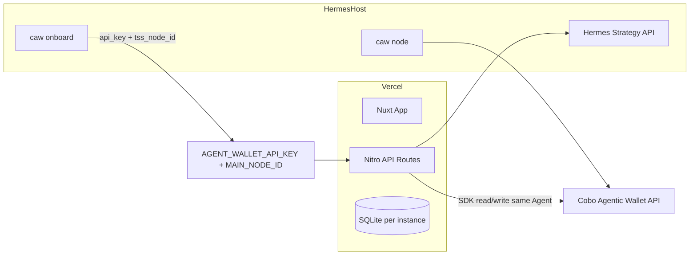

# YieldAgent 产品全面改进设计（路线 A：稳态分体）

**日期**：2026-06-10  
**状态**：待评审  
**前置**：[2026-06-09-project-simplification-phase3-design.md](./2026-06-09-project-simplification-phase3-design.md)（Phase 3 已完成）  
**用户决策摘要**：

| 维度 | 选择 |
|------|------|
| 首要目标 | 可上线产品（稳定部署、凭证可复现） |
| 网络范围 | 仅测试网（Base / Arbitrum Sepolia） |
| 痛点覆盖 | 钱包引导、策略流程、控制台可信度、运维设置 — 全面覆盖 |
| 部署架构 | 暂不确定 → 对比后选定 **路线 A**（保持 Vercel + Hermes 分体，最小改动止血） |

---

## 1. 产品现状诊断

### 1.1 产品定位（与 PRODUCT.md 对齐度）

YieldAgent 是 **Pact 优先** 的 DeFi 收益 Agent 控制台：用户通过 EOA 授权，资金进入独立 Agent Wallet，策略在 Cobo Pact 边界内执行，审计轨迹（含拒绝路径）是第一公民。

**已对齐**：

- `/` 独立 Landing，主 CTA 为连接钱包 → `/dashboard`
- Dashboard 在未完成 Agent Wallet 准备时展示 `DashboardOnboarding`（非裸数据面板）
- 策略模板（保守 / 平衡 / 自定义）+ Pact Preview + `simulate-denial` API
- Phase 3 开发者模式门控 local-draft

**未完全对齐**：

| PRODUCT.md 要求 | 当前差距 |
|-----------------|----------|
| 评委 1 分钟内回答「限制在哪？证据在哪？」 | Dashboard 仍以策略列表 + 收益图为视觉重心；Active Pact 边界与拒绝演示不够「首屏」 |
| 拒绝路径是产品特性 | `simulate-denial` 藏在 Pact 详情操作里，无引导式「演示拒绝」入口 |
| 首次用户路径 Landing → 模板 → Preview → Dashboard | 准备流程错误时（preparing / tss_check）缺少可操作的运维指引，用户卡在技术状态 |
| Agent Wallet bootstrap 双模式 | Vercel `sdk-create` + Hermes `cli-onboard` 凭证不对齐导致 orphan 钱包（已复现） |

### 1.2 用户旅程断点（生产视角）

```text
Landing → Connect EOA → [断点 A] Agent Wallet → [断点 B] Fund USDC
  → Create Strategy → Pact Preview → [断点 C] Cobo App 审批
  → Dashboard 监控 → History / 终止
```

| 断点 | 现象 | 根因 |
|------|------|------|
| A | `preparing` / `tss_check` 长时间不变 | Vercel 无 API Key；或 API Key Agent ≠ Hermes onboard Agent；`MAIN_NODE_ID` 混用本机与 Hermes |
| A | `403 not authorized for this wallet`（Hermes CLI） | 同上：跨 Agent 创建钱包 |
| B | 转入后余额不同步 | Cobo balance API 延迟 / 链上确认轮询不足 |
| C | 用户不知如何在 Cobo App 审批 | `PactAppApprovalGuide` 存在但非强制步骤 |
| 全局 | 设置页 Readiness 与 Wallet 引导信息重复且偏技术 | 缺少面向运营者的「一键自检」叙事 |

### 1.3 技术债清单

| 严重度 | 文件 / 模块 | 问题 |
|--------|-------------|------|
| **高** | `server/utils/caw-wallet-bootstrap.ts` (~822 行) | TSS 检查、bootstrap、poll、pairing、CLI/SDK 双路径耦合；错误 message 曾误导（无 Key 报 TSS 离线） |
| **高** | Vercel + Hermes 分体 | `ensureCawCredentials` 可 auto-provision 新 Agent，与 Hermes TSS 所属 Agent 不一致 |
| **高** | `server/db` + Vercel `/tmp` | SQLite 实例间不共享；Provision 的 Key 可能丢失 |
| **中** | `app/composables/useCreateStrategy.ts` (531 行) | 表单、模板、Hermes 解析、pipeline 状态机、提交逻辑合一 |
| **中** | `app/composables/usePactManagement.ts` (505 行) | 列表、详情、同步、执行、赎回、撤回合一 |
| **中** | `app/stores/app.ts` (455 行) | 单一 store 承载 wallet / prep / strategies / pacts / logs / settings |
| **低** | `app/pages/{create-strategy,pacts,...}.vue` | 已 redirect 到 `/dashboard/*`，可清理为 middleware 统一处理 |
| **低** | 测试 | 33 个 server 单测文件，覆盖率高；**无 E2E**；composable / 页面层无单测 |

### 1.4 UX 痛点清单

| 区域 | 痛点 | 建议方向 |
|------|------|----------|
| Wallet 引导 | bootstrap phase 标签技术化（`tss_check`） | 用户语言 + 可执行 next action（复制 env 清单、跳转设置） |
| Wallet 引导 | 轮询 5s×24 后静默停止 | 显式进度条 + 超时后展示「运维检查清单」而非单行错误 |
| 策略创建 | 531 行 composable 导致页面状态难推理 | 拆 pipeline 子模块；步骤指示器与 Pact Preview 强化 allow/deny |
| Dashboard | PRODUCT 要求 Pact 状态优先 | 首屏增加 Active Pact 边界卡片（maxSpend 余量、允许 Recipes） |
| 拒绝演示 | 藏在 Pact 操作里 | Dashboard 或 Pact 页增加「演示越权拒绝」引导卡片 |
| 设置 / 运维 | Readiness 卡片偏开发 | 增加「部署自检」：API Key 来源、MAIN_NODE_ID、TSS 可达、Agent 一致性 |

---

## 2. 三种改进路线对比

### 路线 A — 稳态分体（**已选**）

保持 Vercel（Nuxt SSR + API）+ Hermes（TSS + Hermes 策略）架构，通过配置约束与 UX 引导消除凭证错位。

| 优点 | 缺点 |
|------|------|
| 改动最小，1–2 周可交付 | 运营者仍需手动对齐 env |
| 不引入新服务 | Vercel serverless 限制仍在 |
| 可渐进改善 UX | sdk-create 路径仍比 cli-onboard 脆弱 |

### 路线 B — Hermes Bootstrap API（后续选项）

在 Hermes 主机暴露 `POST /bootstrap/wallet`、`GET /bootstrap/status`，Vercel 只转发请求，不再调用 `createWallet` / `provision`。

| 优点 | 缺点 |
|------|------|
| 凭证与 TSS 天然同机 | 需维护小型 API + 鉴权 |
| 消除跨 Agent 创建 | 增加部署组件 |

### 路线 C — 统一部署（后续选项）

Nuxt 全栈部署到 Hermes（Docker / PM2），放弃 Vercel serverless。

| 优点 | 缺点 |
|------|------|
| 可用本地 CLI onboard；SQLite 持久 | 失去 Vercel 零运维 CDN |
| 无 Lambda 冷启动 | 需自建 HTTPS / 域名 |

**推荐分阶段**：本轮 A → 若运营负担仍高，再评估 B。

---

## 3. 路线 A 设计方案

### 3.1 架构原则：单 Agent 凭证链



**硬性规则（写入文档 + 启动时校验）**：

1. **禁止** 在已配置 `AGENT_WALLET_API_KEY` 时 auto-provision 新 Agent
2. **禁止** Vercel `MAIN_NODE_ID` 与 Hermes 实际 `tss_node_id` 不一致时继续 createWallet
3. Hermes 上已完成 `caw onboard` 且钱包 `active` 时，**优先 import-agent**，不走 sdk-create
4. Vercel 必须设置 `AGENT_WALLET_API_KEY`（生产路径），不依赖 Provision 作为默认

### 3.2 技术实现 — P0（阻塞上线）

#### 3.2.1 凭证与 Bootstrap 硬化

| 变更 | 文件 | 行为 |
|------|------|------|
| 生产禁用 auto-provision | `caw-wallet-bootstrap.ts` — `ensureCawCredentials` | 当 `AGENT_WALLET_TSS_RUNTIME=hermes-agent-host` 且无 Key 时 `throw`，指引配置 env，不调用 `provisionCawPrincipal` |
| 启动 / readiness 自检 | 新建 `server/utils/caw-deployment-check.ts` | 返回 `{ apiKeySource, mainNodeId, agentIdMatch, tssReachable, walletAgentConsistent }` |
| 暴露自检 API | `server/api/caw/deployment-check.get.ts` | 供设置页与运维使用，不含 secret |
| 改进 TSS 错误 | `checkTssReadiness`（已部分完成） | 区分：无 Key / 403 不匹配 / 真离线 / MAIN_NODE_ID 不一致 |
| import 优先提示 | `DashboardOnboarding` + `create-agent` | 若 env 有 Key 且 detect 到 Hermes 模式，UI 默认展示「导入已 onboard 钱包」为主按钮 |

#### 3.2.2 持久化说明（不改为外部 DB）

本轮 **不** 引入 Supabase/Postgres。采取：

- 文档明确：Vercel 上 `settings.coboApiKey` 应以 **env `AGENT_WALLET_API_KEY`** 为权威来源
- `apiKeySource` 在 readiness 中标注 `env` vs `settings`，settings 来源显示「可能因实例重启丢失，请改用 env」
- 本地开发继续 `.data/yieldagent.db`

#### 3.2.3 路由清理（小改）

- 将 `app/pages/{wallet,create-strategy,pacts,history,settings}.vue` 的 redirect 合并为 `middleware/dashboard-legacy-redirect.ts`（可选，YAGNI：若合并成本高则仅文档标注 legacy）

### 3.3 技术实现 — P1（可维护性，本轮适量）

| 变更 | 范围 | 说明 |
|------|------|------|
| 拆分 bootstrap | `caw-wallet-bootstrap.ts` | 抽出 `caw-tss-readiness.ts`、`caw-sdk-wallet.ts`、`caw-cli-wallet.ts`；**不改变对外 API** |
| 拆分 pipeline | `useCreateStrategy.ts` | 抽出 `useStrategyPipeline.ts`（阶段机）+ `strategy-templates.ts`（纯数据） |
| Store 瘦身 | `app/stores/app.ts` | 抽出 `usePreparationStore` 或 composable 封装 prep 相关 fetch（渐进，非必须一次完成） |

### 3.4 UX 实现 — P0

#### 3.4.1 Wallet 引导（`DashboardOnboarding` + `WalletPrepStepAgent`）

**Bootstrap 阶段用户文案映射**（替代技术 phase 直出）：

| 内部 phase | 用户标题 | 用户说明 | 主操作 |
|------------|----------|----------|--------|
| `tss_check` + 无 Key | 缺少 Cobo 凭证 | Vercel 需配置 `AGENT_WALLET_API_KEY`（与 Hermes onboard 相同） | 打开设置 · 查看部署清单 |
| `tss_check` + 403 | 凭证与钱包不匹配 | 当前 Key 无权操作此钱包 | 重置 → 导入或重建 |
| `bootstrapping` + preparing | Vault 初始化中 | TSS 正在完成 MPC 仪式，通常 1–3 分钟 | 继续等待（进度条） |
| `bootstrapping` + 超时 | 初始化超时 | 展示运维检查清单（4 条） | 继续初始化 / 重置 |
| `pairing` | 等待 CAW App 配对 | 显示配对码与过期时间 | 重新生成配对码 |

**轮询 UX**：

- 显示 `第 N/24 次检查` 细进度（非仅 spinner）
- 超时后展开「运维检查清单」折叠面板（链接到 README 部署章节）

#### 3.4.2 设置页运维卡片（`CawReadinessCard` 增强）

新增 **部署自检** 区块（消费 `deployment-check` API）：

- API Key：已配置 / 来源 env|settings / 是否建议改用 env
- MAIN_NODE_ID：已配置 / 与远程 TSS 绑定是否一致
- Agent Wallet：created / pairing / wallet status
- 一键复制「Vercel 环境变量模板」（占位符，不含真实 Key）

#### 3.4.3 Dashboard 可信度（`dashboard/index.vue`）

调整首屏信息架构（符合 PRODUCT.md 优先级）：

1. **Active Pact 边界卡**（新建 `DashboardActivePactCard.vue`）：maxSpend 余量、允许 Recipes、到期时间、状态 chip
2. **最近审计**（现有 `RecentLogsTable`，提升位置）
3. 策略列表
4. 收益图（保持次要）

#### 3.4.4 拒绝演示引导

在 Dashboard 或 Pact 列表为空时，展示 **「体验 Pact 边界」** 卡片：

- 说明：模拟一笔超出白名单的请求
- CTA：跳转至最新 active/pending Pact 的「模拟拒绝」或预置 demo 策略

### 3.5 UX 实现 — P1

| 项 | 说明 |
|----|------|
| 策略创建步骤条 | `StepIndicator` 与 pipeline stage 完全同步 |
| Pact Preview allow/deny | 视觉分区强化（已有结构，调整层级与图标） |
| Cobo App 审批 | 创建策略成功后 modal 引导 + 链到 `PactAppApprovalGuide` |
| `prefers-reduced-motion` | 轮询进度用宽度变化替代 pulse |

---

## 4. 测试策略

| 层级 | 本轮新增 |
|------|----------|
| 单测 | `caw-deployment-check.test.ts`；`ensureCawCredentials` 生产路径禁止 provision；bootstrap message 映射纯函数测试 |
| 单测 | `dashboard-active-pact` 数据选取逻辑（从 store pacts 挑 active） |
| 手动 | Vercel 部署清单验证脚本（文档化 checklist，非自动化 E2E） |
| 非目标 | Playwright E2E（留给后续） |

---

## 5. 文档交付

| 文件 | 内容 |
|------|------|
| `README.md` | 新增「Vercel + Hermes 生产部署」专节：env 清单、禁止 provision、import 优先、故障排查 |
| `docs/caw-integration.md` | 补充单 Agent 凭证规则、403 排查树 |
| `.env.example` | 标注 `AGENT_WALLET_API_KEY` 在分体部署下为 **必填** |

---

## 6. 非目标（YAGNI）

- 主网 / 真实资金
- Supabase / 外部数据库
- 路线 B Bootstrap API 实现（仅文档记录为 Phase 2 选项）
- Nuxt 迁出 Vercel（路线 C）
- Phase 4 收益快照
- 全面拆分 `usePactManagement`（除非 P0 时间充裕）

---

## 7. 交付分期

### Phase A0 — 上线止血（~3–5 天）

- 凭证硬化 + deployment-check API
- bootstrap 错误文案 + Wallet 引导 UX
- README / docs 部署专节

### Phase A1 — 产品可信度（~3–5 天）

- Dashboard Active Pact 卡 + 拒绝演示引导
- 设置页部署自检 UI
- 策略创建审批引导 modal

### Phase A2 — 工程卫生（~2–3 天，可并行）

- `caw-wallet-bootstrap` 文件拆分
- `useCreateStrategy` 抽出 pipeline / templates
- legacy redirect middleware（可选）

---

## 8. 成功标准

1. 新运营者按 README 配置 Vercel env 后，**无需改代码** 即可完成 Agent Wallet（import 或 create）+ 配对 + 注资
2. 凭证错位时，UI **10 秒内** 给出可执行指引（非「TSS 离线」误导）
3. Dashboard 首屏可见 Active Pact 边界与最近审计
4. 评委可在产品内发现并完成一次「越权拒绝」演示
5. 现有 `pnpm test` 全绿，新增 deployment-check 相关测试

---

## 9. 后续选项（未选路线备忘）

- **路线 B**：当 env 手动对齐仍频繁失败时，在 Hermes 增加 bootstrap proxy API
- **路线 C**：当需要 demo 稳定性高于 Vercel 便利时，评估 Docker 统一部署

---

## Spec 自检

- [x] 无 TBD / 占位符
- [x] 架构与 Phase 3 开发者模式不冲突
- [x] 范围适合单条 implementation plan（可分 A0/A1/A2 任务）
- [x] 「仅测试网」与「可上线」界定清晰：产品完整、资金测试网、运维可复现
